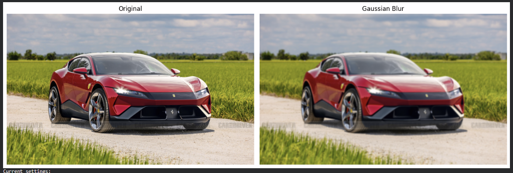

# Computer Vision Project

[]
(https://colab.research.google.com/github/Edris-L/Computer-Vision/blob/main/FinalProjectUpdated.ipynb)

Dataset Description

This project uses input images for testing various computer vision filters and transformations.

The images include standard photos (e.g., faces, objects, or natural scenes) used to demonstrate the effects of different filters such as Gaussian blur, sharpening, edge detection, and bilateral filtering.

All images are used for educational purposes only.

The dataset is small and manually selected to clearly show the visual differences between filters and parameter changes.

Below is an example of a car iamge being put through the gaussian blue image through the code. This is one of the many filters in the code.

## Example Result

  

